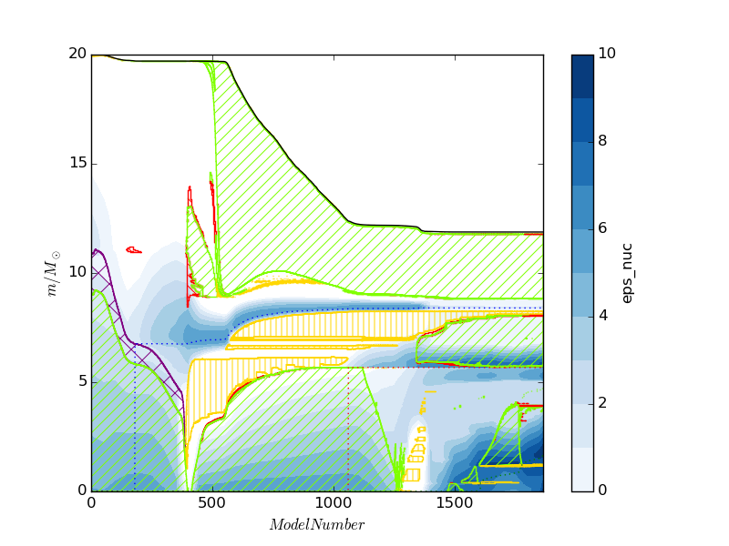
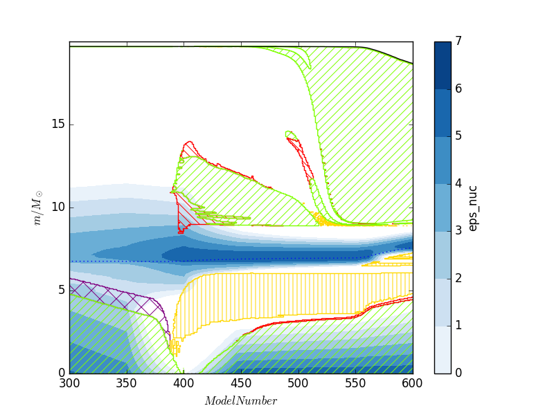
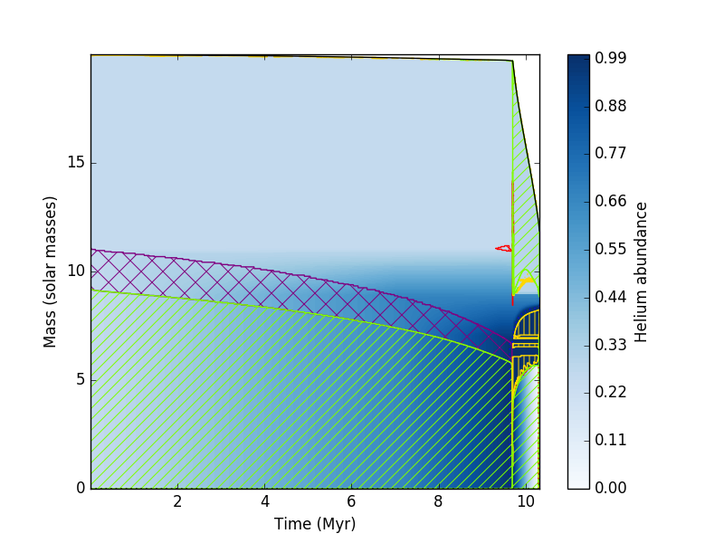
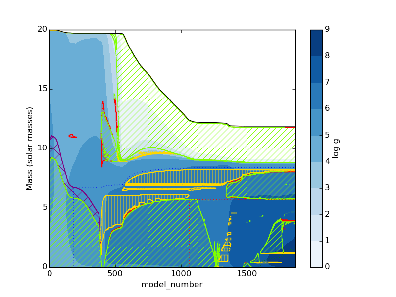
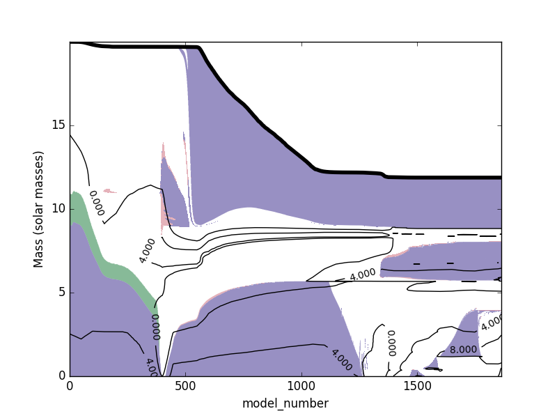

# mkipp
Kippenhahn plotter for MESA. BEWARE: this README might be out of date! In case the examples don't work refer to the example.py file in the repository.

!!!!!!!!!!!!!!!!!!!!!!!!!!!!!!!!!!!!!!!!!!!!!!!!!!!!

IMPORTANT!! your history_columns.list needs to have mixing_regions and mix_relr_regions specified for MESA to output the neccesary data of the mixing regions in terms of mass and radius respectively.
Also, newer versions of MESA include significantly less output in the profile files, so values such as eps_nuc need to be added to profile_columns.list as well.

!!!!!!!!!!!!!!!!!!!!!!!!!!!!!!!!!!!!!!!!!!!!!!!!!!!!

The Kippenhahn plotter consists of 3 files:
- mesa_data.py: a simple parser of MESA data files that only parses specific columns to save time
- kipp_data.py: process data for Kippenhan plot
- mkipp.py: the Kippenhahn plotter
 
Although lower-level functions are provided that allow plotting directly into a matplotlib axis object, a high level function produces a fully decorated plot. The repository comes with some sample MESA data for a 20 Msun star, which if used with the following python script
```python
import mkipp
mkipp.kipp_plot(mkipp.Kipp_Args())
```
results in the following plot


Here is an example that changes the default filename and the x limits. When x limits are specified the plotter optimizes which profile data it reads. To save a pdf just change the filename extension.
```python
import mkipp
mkipp.kipp_plot(mkipp.Kipp_Args(save_filename = "Kippenhahn2.png"), xlims = [300,600])
```
which results in the following plot


Several options can be passed to mkipp.Kipp_Args():
```python
#properties of the plotter
class Kipp_Args:
    def __init__(self,
            logs_dirs = ['LOGS'],
            profile_paths = [],
            history_paths = [],
            clean_data = True,
            extra_history_cols = [],
            identifier = "eps_nuc",
            extractor = default_extractor,
            log10_on_data = True,
            contour_colormap = plt.get_cmap("Blues"),
            levels = [],
            log_levels = True,
            num_levels = 8,
            xaxis = "model_number",
            xaxis_divide = 1.0,
            time_units = "Myr",
            function_on_xaxis = lambda x: x,
            yaxis = "mass",
            yaxis_normalize = False,
            show_conv = True, show_therm = True, show_semi = True, show_over = True, show_rot = False,
            core_masses = ["He","C","O"],
            yresolution = 1000,
            mass_tolerance = 0.0000001,
            radius_tolerance = 0.0000001,
            decorate_plot = True,
            show_plot = False,
            save_file = True,
            save_filename = "Kippenhahn.png"):
        """Initializes properties for a Kippenhahn plot

        Note:
            All arguments are optional, if not provided defaults are assigned

        Args:
            logs_dir (List[str]): List of paths to MESA LOGS directories. If profile_paths and
                history_paths are not provided, they are automatically generated from logs_dir.
            profile_paths (List[str]): List of paths to MESA profile files.
            history_paths (List[str]): List of paths to MESA history files.
            clean_data (bool): Clean history files in case of redos. If data has no redos,
                a small performance gain can be had by setting this to False.
            extra_history_cols (List[str]): Additional column names to be extracted from history files.
            identifier (str): String used as identifier of data to plot. If not using any custom
                extractors this is simply the column name in the profile file that will be extracted.
                Default uses eps_nuc.
            extractor (function): Custom function to read out profile data. Allows to extract
                data that is not included by default but can be computed from the given profiles
            log10_on_data (bool): Determines if log10(abs()) is applied to profile data
            contour_colormap (matplotlib.cm): matplotlib color map used to plot contours
            levels (List): List of fixed levels for contour plot (int or float)
            log_levels (bool): if levels is an empty list then they are auto-generated. This
                variable specifies if the date is the log of a quantity or not, in order to
                produce discrete integer levels.
            num_levels (int): Number of automatically generated levels
            xaxis (str): variable for the xaxis, either "model_number" or "star_age"
            xaxis_divide (float): divide xaxis by this value
            time_units (str): When using xaxis = "star_age" this specifies the unit of time
                and sets the value of xaxis_divide. Options are "yr", "Myr" and "Gyr"
            function_on_xaxis (function): after dividing by xaxis_divide, this function is applied
                to all xvalues of the data
            yaxis (str): Quantity plotted in the yaxis. Either "mass" or "radius"
            yaxis_normalize (bool): If True Normalize yaxis at each point using total mass/total radius
            show_conv, show_therm, show_semi, show_over, show_rot (bool): Specifies whether or
                certain mixing regions are displayed.
            core_masses (List(str)): Strings with core masses to plot. Options are "He", "C" and "O".
                Only for yaxis=mass
            yresolution (int): resolution for contour plotting
            mass_tolerance (float): ignore mixing regions smaller than this in solar masses. Ignored
                if yaxis="radius"
            radius_tolerance (float): ignore mixing regions smaller than this in solar radii. Ignored
                if yaxis="mass"
            decorate_plot (bool): If True, then axis labels are included.
            show_plot (bool): If True, pyplot.show() is ran at the end
            save_file (bool): If True, plot is saved after pyplot.show()
            save_filename (str): Filename to save plot. Extension determines filetype.

        """
```

Also a matplotlib axis object can be passed to kipp_plot. This allows plot decorations to be made independently, or can be also used to make a plot with many different Kippenhahn plots. As an example, the following plots evolution of Helium abundance with respect to time for the same model as before
```python
import mkipp
import matplotlib.pyplot as plt
import numpy as np
#plot of Helium abundance against time, independent decoration
fig = plt.figure()
axis = plt.gca()
#mkipp.kipp_plot returns an object containing
#   kipp_plot.contour_plot : the return value of matplotlibs contourf. Can be
#                            used to create a colorbar with plt.colorbar() 
#   kipp_plot.histories    : list of history files read. data can be accesed from this
#                            using the get("column_name") function
#   kipp_plot.xlims        : limits of data in x coordinate
kipp_plot = mkipp.kipp_plot(mkipp.Kipp_Args(
        xaxis = "star_age",
        time_units = "Myr",
        identifier = "y",
        log10_on_data = False,
        levels = np.arange(0.0,1.001,0.01),
        decorate_plot = False,
        save_file = False), axis = axis)
bar = plt.colorbar(kipp_plot.contour_plot,pad=0.05)
bar.set_label("Helium abundance")
axis.set_xlabel("Time (Myr)")
axis.set_ylabel("Mass (solar masses)")
axis.set_xlim(kipp_plot.xlims)
plt.savefig("Kippenhahn3.png")
```
which results in the following plot


It is also possible to apply a function to the xaxis. This can be used to generate a log(tf-t) plot. Here we also make use of the Mesa_Data class to read out the maximum age first.
```python
import mkipp
import matplotlib.pyplot as plt
import numpy as np
import mesa_data
#read out max age of star first, then create a log(tf-t) plot
fig = plt.figure()
axis = plt.gca()
#only need to read star_age column first
history = mesa_data.Mesa_Data("LOGS/history.data", read_data_cols = ["star_age"])
max_age = max(history.get("star_age"))
kipp_plot = mkipp.kipp_plot(mkipp.Kipp_Args(
        xaxis = "star_age",
        time_units = "yr",
        function_on_xaxis = lambda x: np.log10(max_age+0.01 - x),
        decorate_plot = False,
        save_file = False), axis = axis)
bar = plt.colorbar(kipp_plot.contour_plot,pad=0.05)
bar.set_label("log |eps_nuc|")
axis.set_xlabel("log (tf-t) [yrs]")
axis.set_ylabel("Mass (solar masses)")
plt.savefig("Kippenhahn4.png")
```
which results in the following plot


Sometimes you might want to plot data resulting from operations on the columns of profile files. Instead of re-running a MESA model with extra columns, to extract the required data you can just pass a function that computes it. In this case, I make a plot of log g.
```python
import mkipp
import matplotlib.pyplot as plt
import numpy as np
#add custom extractor to compute g
fig = plt.figure()
axis = plt.gca()
msun = 1.99e33
rsun = 6.96e10
cgrav = 6.67e-8
def g_extractor(identifier, log10_on_data, prof, return_data_columns = False):
    if return_data_columns:
        return ["radius", "mass"]
    data = cgrav*prof.get("mass")*msun/(prof.get("radius")*rsun)**2
    if log10_on_data:
        return np.log10(data)
    else:
        return data
kipp_plot = mkipp.kipp_plot(mkipp.Kipp_Args(
        extractor = g_extractor,
        decorate_plot = False,
        save_file = False), axis = axis)
bar = plt.colorbar(kipp_plot.contour_plot,pad=0.05)
bar.set_label("log g")
axis.set_xlabel("model_number")
axis.set_ylabel("Mass (solar masses)")
plt.savefig("Kippenhahn5.png")
```
which results in the following plot


The data from mixing regions and profiles can be extracted using lower level functions and plotted in an arbitrary form. The following is an (ugly) example:

```python
import mkipp
import kipp_data
import mesa_data
import matplotlib.pyplot as plt
from matplotlib.patches import PathPatch
import numpy as np
#Reading out mixing regions and data, and plotting independently
kipp_args = mkipp.Kipp_Args()
fig = plt.figure()
axis = plt.gca()
profile_paths = mesa_data.get_profile_paths(["LOGS"])
#if data is distributed among several history.data files, you can provide them
history_paths = ["LOGS/history.data"]
#read profile data
#kipp_data.get_xyz_data returns an object containing
#   xyz_data.xlims : limits of data in x coordinate
#   xyz_data.X     : 2D array of xaxis values of profile data
#   xyz_data.Y     : 2D array of xaxis values of profile data
#   xyz_data.Z     : 2D array of xaxis values of profile data
# the last three can be used as inputs for matplotlib contour or contourf
xyz_data = kipp_data.get_xyz_data(profile_paths, kipp_args)
#read mixing regions 
#kipp_data.get_mixing_zones returns an object containing
#   mixing_zones.zones     : matplotlib Path objects for each mixing zone.
#                            These can be plotted using add_patch(...)
#   mixing_zones.mix_types : Integer array containing the type of each zone
#   mixing_zones.x_coords  : x coordinates for points at the surface
#   mixing_zones.y_coords  : y coordinates for points at the surface
#   mixing_zones.histories : mesa_data history files to access additional data
# the last three can be used as inputs for matplotlib contour or contourf
mixing_zones = kipp_data.get_mixing_zones(history_paths, kipp_args, xlims = xyz_data.xlims)
# just plot convection, overshooting and semiconvection
for i,zone in enumerate(mixing_zones.zones):
    color = ""
    #Convective mixing
    if mixing_zones.mix_types[i] == 1: #convection
        color = '#332288'
    #Overshooting 
    elif mixing_zones.mix_types[i] == 3: #overshooting
        color = '#117733'
    #Semiconvective mixing
    elif mixing_zones.mix_types[i] == 4: #semiconvection
        color = '#CC6677'
    else:
        continue
    axis.add_patch(PathPatch(zone, color=color, alpha = 0.5, lw = 0))
if (xyz_data.Z.size > 0):
    CS = plt.contour(xyz_data.X, xyz_data.Y, xyz_data.Z, [0,4,8], colors='k')
    plt.clabel(CS, inline=1, fontsize=10)
axis.plot(mixing_zones.x_coords, mixing_zones.y_coords, 'k', lw=4)
axis.set_xlabel("model_number")
axis.set_ylabel("Mass (solar masses)")
axis.set_xlim(0,max(mixing_zones.x_coords))
axis.set_ylim(0,max(mixing_zones.y_coords))
plt.savefig("Kippenhahn6.png")
```
which gives the following ugly result (just an example!)

